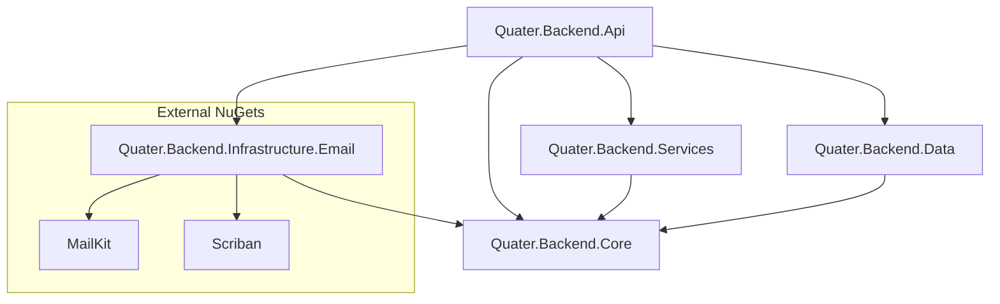

# Email System Research & Architecture

## 1. Structure Decision

We will introduce a new **Infrastructure** layer project specifically for email concerns to decouple external providers (SMTP, Templating) from the core business logic.

**New Project:**
- **Path**: `backend/src/Quater.Backend.Infrastructure.Email/`
- **Name**: `Quater.Backend.Infrastructure.Email.csproj`
- **Framework**: `.NET 10`

**Internal Folder Structure:**
```
Quater.Backend.Infrastructure.Email/
├── BackgroundJobs/
│   └── EmailBackgroundService.cs   # Background worker (IHostedService)
├── Options/
│   └── SmtpOptions.cs              # Configuration binding
├── Services/
│   ├── SmtpEmailService.cs         # Implementation of IEmailSender
│   ├── ScribanEmailTemplateService.cs # Implementation of IEmailTemplateService
│   └── InMemoryEmailQueue.cs       # Implementation of IEmailQueue
├── Templates/                      # Embedded Resources
│   ├── _Layout.html
│   ├── Welcome.html
│   └── Alert.html
└── DependencyInjection.cs          # Extension method to register services
```

---

## 2. Dependency Map

This restructuring adheres to **Clean Architecture** principles, pushing volatile dependencies to the outer edge.

### Reference Graph



### NuGet Package Moves
- **Remove** from `Quater.Backend.Services`:
  - `MailKit`
  - `Scriban`
- **Add** to `Quater.Backend.Infrastructure.Email`:
  - `MailKit`
  - `Scriban`
  - `Microsoft.Extensions.Options.ConfigurationExtensions`
  - `Microsoft.Extensions.Hosting.Abstractions`

### Abstractions (Stay in Core)
The following interfaces remain in `Quater.Backend.Core` to ensure `Services` can send emails without knowing *how* they are sent:
- `IEmailSender`
- `IEmailTemplateService`
- `IEmailQueue`

---

## 3. Template Storage Decision

**Recommendation: Embedded Resources**

For a class library that might be distributed or containerized, **Embedded Resources** are superior to Content Files because they are compiled directly into the assembly. This eliminates issues with file system paths in Docker containers or different OS environments.

**Implementation Details:**
1.  **Project File (.csproj)**:
    ```xml
    <ItemGroup>
      <EmbeddedResource Include="Templates\**\*.html" />
    </ItemGroup>
    ```
2.  **Access**:
    Load templates using `Assembly.GetManifestResourceStream()`.

---

## 4. API Reference Strategy

The API project should reference `Quater.Backend.Infrastructure.Email` **directly**.

While strict Clean Architecture sometimes advocates for the API to not reference Infrastructure (using a separate Composition Root), for a pragmatic monolithic solution like Quater, referencing it in the API project to access the `AddEmailInfrastructure()` extension method is the standard and most maintainable approach.

**Usage in Program.cs:**
```csharp
builder.Services.AddEmailInfrastructure(builder.Configuration);
```
